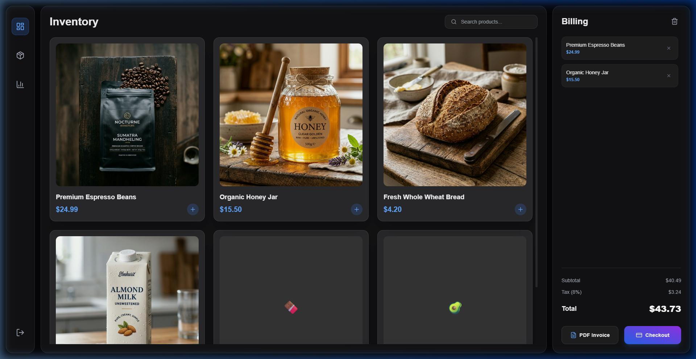

# 🚀 Ultra-Modern Supermarket POS System

A professional, high-tech dashboard for supermarket point-of-sale management, built with **React**, **Tailwind CSS v4**, and **jsPDF**. Featuring a sleek dark mode with glassmorphism, realistic product imagery, and multi-page navigation.



## ✨ Features

- **💎 Glassmorphism UI**: High-end aesthetic with vibrant blue/purple accents and deep backdrop blurs.
- **📦 Inventory Management**: Interactive product grid with ultra-realistic AI-generated imagery.
- **🛒 Dynamic Billing**: Real-time cart calculations including automatic tax (8%) and subtotal tracking.
- **📄 PDF Invoice Generation**: Generate professional, formatted PDF invoices instantly with one click.
- **📊 Multi-Page Navigation**: Includes dedicated routes for Inventory, Sales Dashboard, and Reports Center.
- **⚡ Built with Speed**: Powered by Vite for lightning-fast HMR and build performance.

## 🛠️ Tech Stack

- **Frontend**: React 19 + Vite 8
- **Styling**: Tailwind CSS (Lucide Icons for high-tech aesthetics)
- **PDF Logic**: jsPDF for client-side invoice generation
- **Routing**: React Router v7

## 🚀 Getting Started

### Prerequisites

- Node.js (v18 or higher)
- npm or yarn

### Installation

1. Clone the repository:
   ```bash
   git clone https://github.com/lakshan-bandara/Modern-Supermarket-POS-System.git
   ```

2. Navigate to the project directory:
   ```bash
   cd "POS system"
   ```

3. Install dependencies:
   ```bash
   npm install
   ```

4. Start the development server:
   ```bash
   npm run dev
   ```

## 📸 Screenshots

### Inventory View


## 👨‍💻 Developer

Developed **lakshan** (or Lakshan Bandara, as per previous contexts).

---
*Trending on Dribbble & Modern POS UI/UX Standards.*
